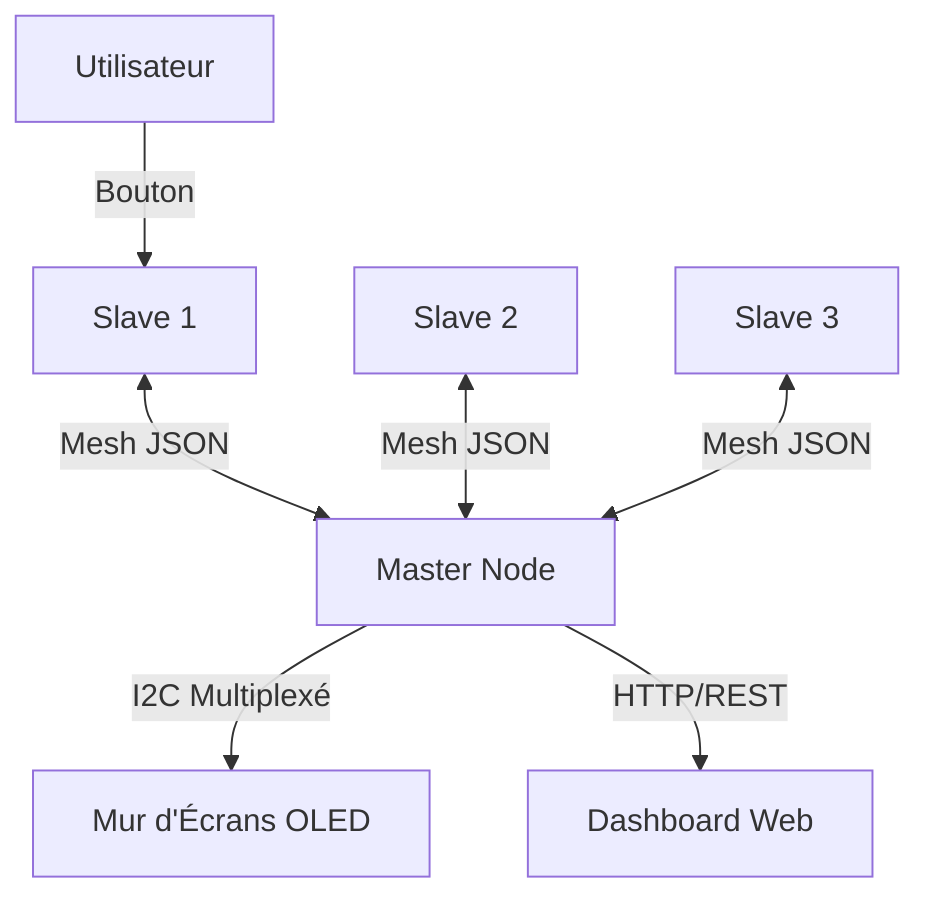

# Documentation Technique - DispoMesh v6.0

## 1. Vue d'Ensemble du Système

**DispoMesh** est un système de signalétique de disponibilité distribué basé sur des microcontrôleurs ESP32 communiquant via un réseau maillé (Mesh).

Le système est composé de deux types d'unités :

1. **Le Master (Récepteur)** : Unité centrale qui agrège les données, héberge le tableau de bord web et affiche les statuts sur un mur d'écrans OLED.
2. **Les Slaves (Émetteurs)** : Boîtiers individuels placés sur les bureaux, permettant aux utilisateurs de changer leur statut via un bouton physique.

### Architecture Logique



---

## 2. Le Nœud Maître (Master Récepteur)

Le Master est le cerveau du système. Il est configuré comme le nœud **ROOT** du réseau maillé, ce qui stabilise la topologie du réseau.

### 2.1 Gestion des Écrans (Multiplexage I2C)

Le Master gère jusqu'à 5 écrans OLED simultanément. Comme les écrans OLED ont tous la même adresse I2C (`0x3C`), un multiplexeur **TCA9548A** est utilisé.

* **Fichier** : `master_recepteur.ino`
* **Fonction clé** : `tcaSelect(uint8_t i)`
* **Logique** : Avant chaque commande de dessin, le code sélectionne le canal I2C approprié sur le multiplexeur.
* **Hot-Plug** : La fonction `checkScreens()` vérifie périodiquement (toutes les 5s) la présence physique des écrans pour éviter de bloquer le bus I2C si un écran est débranché.

### 2.2 Serveur Web & Interface (SPIFFS)

L'interface utilisateur n'est pas codée en dur dans le C++. Elle est stockée dans la mémoire flash du système de fichiers (SPIFFS).

* **Structure** :
  * `/index.html` : Structure HTML5 moderne.
  * `/style.css` : Styles "Glassmorphism" et animations.
  * `/script.js` : Logique frontend (récupération des données API).
* **API REST** : Le Master expose l'endpoint `/api/data` qui renvoie un JSON complet contenant l'état de tous les slots, l'historique et l'uptime.

### 2.3 Robustesse & Watchdog

Pour garantir un fonctionnement 24/7 :

* **Hardware Watchdog** : Si la boucle principale (`loop`) se bloque plus de 10 secondes, l'ESP32 redémarre automatiquement.
* **Heartbeat Monitor** : Le Master surveille les battements de cœur des Slaves. Si un Slave ne donne pas signe de vie pendant 60 secondes (`HEARTBEAT_TIMEOUT_MS`), il est marqué comme déconnecté.

### 2.4 Économiseur d'Écran (Screen Saver)

Pour éviter le marquage des écrans OLED (burn-in) et réduire la consommation :

* Si aucune activité (message Mesh reçu ou appel API) n'est détectée pendant 10 minutes, les écrans s'éteignent et les LEDs diminuent d'intensité.
* Le réveil est instantané au moindre événement.

---

## 3. Le Nœud Esclave (Slave Émetteur)

Le Slave est conçu pour être autonome et économe en énergie.

### 3.1 Gestion des États

L'utilisateur change son statut via un bouton poussoir unique.

* **États** : Disponible (Vert) -> Occupé (Rouge) -> Absent (Orange).
* **Feedback** : Une LED NeoPixel et un écran OLED local confirment l'état.

### 3.2 Mode Éco (Deep Power Saving)

Si l'utilisateur reste en statut "ABSENT" pendant plus de 5 minutes, le Slave entre en mode économie d'énergie agressif :

1. **CPU Downclocking** : La fréquence du processeur passe de 240MHz à 80MHz.
2. **WiFi Power Save** : Activation du mode `WIFI_PS_MIN_MODEM`.
3. **Dimming** : La luminosité des LEDs est réduite au minimum.

### 3.3 Communication

* **Heartbeat** : Envoie un message `heartbeat` toutes les 30 secondes pour dire au Master "Je suis vivant".
* **Broadcast** : Envoie un message `status` immédiatement lors d'un appui bouton.

---

## 4. Protocole de Communication (JSON)

Les échanges se font via des paquets JSON légers sur le réseau `painlessMesh`.

### Types de Messages

**1. Enregistrement (`register`)**
Envoyé par le Slave au démarrage pour s'associer à un slot.

```json
{
  "type": "register",
  "prenom": "Jean",
  "nom": "Dupont",
  "etat": 0
}
```

**2. Mise à jour de Statut (`status`)**
Envoyé lors d'un appui bouton.

```json
{
  "type": "status",
  "etat": 1
}
```

**3. Battement de Cœur (`heartbeat`)**
Envoyé périodiquement.

```json
{
  "type": "heartbeat",
  "slotId": 2,
  "etat": 1,
  "eco": false
}
```

---

## 5. Guide de Déploiement

Un script automatisé `deploy.sh` facilite la mise à jour des boîtiers.

### Pré-requis

* PlatformIO Core (CLI) installé.
* Drivers USB-Série (CH340 ou CP210x) installés.

### Procédure

1. Connecter le Master en USB.
2. Lancer `./deploy.sh`.
3. Sélectionner le port du Master. Le script va :
    * Créer l'image du système de fichiers (SPIFFS) avec les fichiers web.
    * Téléverser le SPIFFS.
    * Compiler et téléverser le Firmware.
4. Connecter ensuite les Slaves un par un et suivre les instructions du script.
