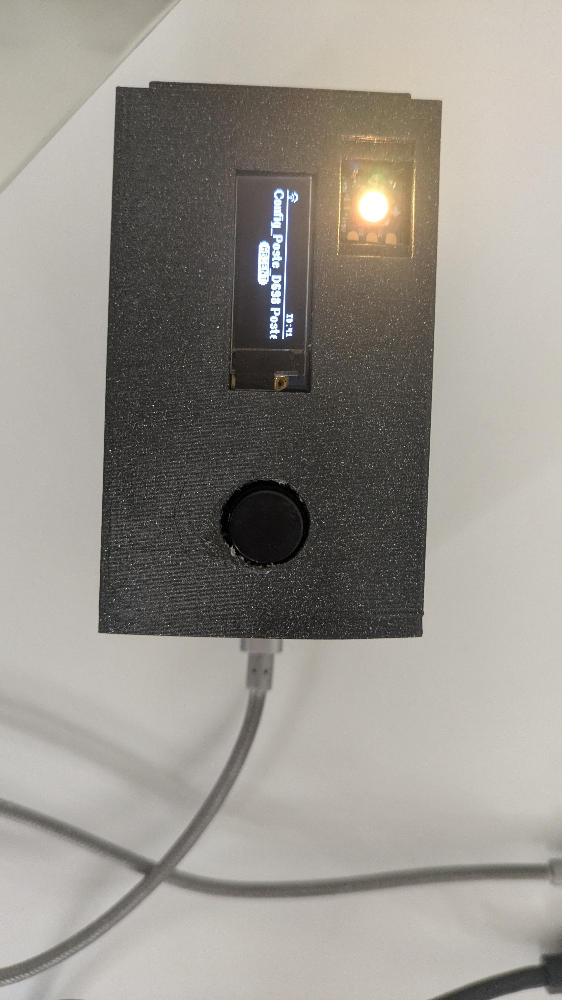
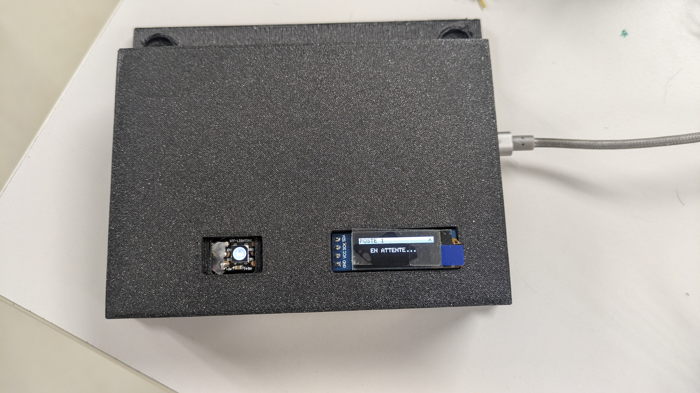
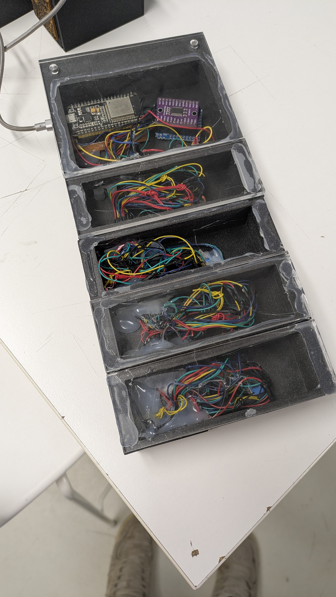
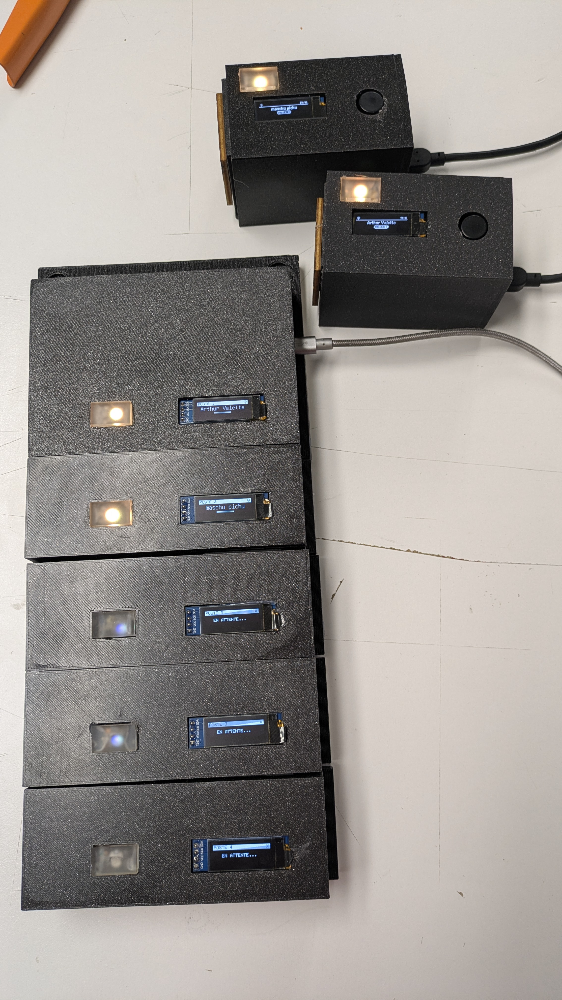

# 📡 DispoMesh - Système de Disponibilité Connecté

  

**DispoMesh** est une solution intelligente et autonome pour visualiser en temps réel la disponibilité des collaborateurs dans un open-space ou des bureaux partagés. Fini les interruptions inutiles : un coup d'œil suffit pour savoir si votre collègue est disponible, occupé ou absent.

---

## ❓ La Problématique

Dans les écoles et laboratoires, les **enseignants-chercheurs** travaillant en open-space sont fréquemment sollicités par les étudiants, souvent au détriment de leur concentration.

* *"Est-ce que je peux entrer pour poser une question ?"*
* *"Le professeur est-il en pleine recherche ou disponible ?"*
* *"Est-il en réunion ou simplement concentré ?"*

Ces interruptions constantes par les élèves nuisent à la productivité et à la qualité du travail de recherche. Ça nuit à leur travail et ainsi qu'à tous les autres s'il n'est pas là.

---

## 🎯 Objectif du Projet

Créer un système **simple, visuel et décentralisé** permettant à chaque collaborateur d'indiquer son statut via un petit boîtier sur son bureau. Ces informations sont instantanément répercutées sur un **tableau de bord central** (mur d'écrans OLED) et une **interface web**.

### Les 3 États Clés

* 🟢 **DISPONIBLE** : "Vous pouvez venir me voir."
* 🔴 **OCCUPÉ** : "Je suis concentré / en réunion, ne pas déranger."
* 🟠 **ABSENT** : "Je ne suis pas à mon poste."

---

## 🏗️ Architecture & Fonctionnement

Le système repose sur un réseau **WiFi Mesh** (maillé) autonome. Il ne nécessite pas de connexion Internet ni d'infrastructure complexe.

### 1. Les Boîtiers "Slave" (Sur les bureaux)

Chaque collaborateur dispose d'un petit boîtier autonome.

* **Action** : Un simple bouton pour changer de statut.
* **Feedback** : Une LED (Verte/Rouge/Orange) et un petit écran confirment le statut actuel.
* **Intelligence** : Si vous oubliez de vous mettre en "Absent", le boîtier passe automatiquement en **Mode Éco** après 5 minutes d'inactivité.
* **Configuration facile** : Au premier démarrage, le boîtier crée un WiFi de config. Après configuration, il se connecte automatiquement au réseau.
* **Reset sans ordinateur** : Maintenir le bouton 5 secondes au démarrage pour réinitialiser la configuration.

### 2. Le Boîtier "Master" (À l'entrée ou au mur)

C'est le cerveau du système.

* **Affichage** : Un mur d'écrans OLED affiche la liste de tous les collaborateurs et leur statut en temps réel.
* **Dashboard Web** : Héberge un site web local accessible par tous pour voir les disponibilités depuis son smartphone ou PC.
* **Animation** : Effets visuels fluides et indicateurs LED pour une lecture rapide.

---

## ✨ Fonctionnalités Clés

* **🚀 Plug & Play** : Branchez, ça marche. Le réseau se crée tout seul.
* **⚡ Temps Réel** : Changement de statut instantané (< 100ms).
* **🔋 Économie d'Énergie** : Mise en veille automatique des écrans et processeurs.
* **📱 Interface Web Moderne** : Dark mode, responsive, QR Code pour connexion facile.
* **🛡️ Robuste** : Redémarrage automatique en cas de bug (Watchdog), reconnexion automatique au réseau.

---

## 🛠️ Comment le refaire chez soi ?

### Matériel Requis

Pour un kit de démarrage (1 Master + 1 Slave) :

* **2x ESP32 DevKit V1** (ou compatible).
* **5x Écrans OLED SSD1306** (128x32 pixels, I2C).
* **1x Multiplexeur I2C TCA9548A** (pour le Master, permet de brancher plusieurs écrans même adresse).
* **Ruban LED NeoPixel (WS2812B)** (au moins 6 LEDs).
* **1x Bouton Poussoir** (pour le Slave).
* **Câbles Dupont** et Breadboards.

### Câblage

#### 🔌 Master (Récepteur)

* **Écrans OLED** : Via le Multiplexeur TCA9548A (Adresse 0x70).
  * SDA ESP32 (D21) -> SDA TCA
  * SCL ESP32 (D22) -> SCL TCA
  * Écrans sur les canaux TCA : 0, 1, 2, 6, 7.
* **LEDs NeoPixel** : Pin **D27**.

#### 🔌 Slave (Émetteur)

* **Écran OLED** : Directement sur I2C.
  * SDA -> D21
  * SCL -> D22
* **Bouton** : Pin **D32** (avec Pull-down interne ou externe).
* **LED NeoPixel** : Pin **D27**.

### Installation Logicielle

#### Option A : Via PlatformIO (Recommandé)

1. **Pré-requis** :
   * [VS Code](https://code.visualstudio.com/)
   * Extension **PlatformIO IDE** pour VS Code.

2. **Cloner le projet** :

    ```bash
    git clone https://github.com/flavio-cbz/dispo-mesh-system.git
    cd dispo-mesh-system
    ```

3. **Bibliothèques (Gérées automatiquement par PlatformIO)** :
   * `painlessMesh` (v1.5.7)
   * `ArduinoJson` (v7.4.2)
   * `Adafruit SSD1306` (v2.5.9)
   * `Adafruit GFX Library` (v1.11.9)
   * `Adafruit NeoPixel` (v1.12.0)
   * `U8g2_for_Adafruit_GFX` (v1.0.2)

4. **Déployer** :
    Connectez vos ESP32 et utilisez le script de déploiement ou les tâches PlatformIO "Upload".

    ```bash
    ./deploy.sh
    ```

    Suivez les instructions à l'écran pour flasher le Master puis les Slaves.

#### Option B : Via Arduino IDE (Manuel)

Si vous préférez l'IDE Arduino classique :

1. Installez les bibliothèques listées ci-dessus via le **Gestionnaire de bibliothèques**.
2. Ouvrez `master_recepteur/src/master_recepteur.ino` pour le Master.
3. Ouvrez `slave_emetteur/src/slave_emetteur.ino` pour les Slaves.
4. Sélectionnez votre carte (ESP32 Dev Module) et le port, puis téléversez.

### 📸 Galerie

#### L'Émetteur (Slave)


*Le boîtier Slave avec son bouton et son écran de statut.*

#### Le Récepteur (Master)



*Le Master et son câblage (Multiplexeur I2C visible à l'arrière).*

#### Montage Complet


*Vue d'ensemble du système DispoMesh en fonctionnement.*

### 🎥 Démos Vidéo

#### Fonctionnement Général

<video src="Photos/Demo_courte_recepteur.mp4" controls width="100%"></video>

#### Démonstration du Reset

<video src="Photos/Demo_Reset.mp4" controls width="100%"></video>

4. **Profiter !**
    Les boîtiers se connectent entre eux automatiquement. Connectez-vous au WiFi `DispoMesh` (mot de passe: `meshpass2025`) pour accéder au dashboard.

---

## 📚 Documentation

* Pour les détails techniques approfondis (architecture code, protocole JSON, hardware), consultez la [Documentation Technique](DOCUMENTATION_TECHNIQUE.md).

---

## 📄 Licence

Ce projet est open-source sous licence **MIT**. Sentez-vous libre de le modifier, l'améliorer et le partager !

---
*Développé par Flavio COMBLEZ pour simplifier la vie de bureau.*
